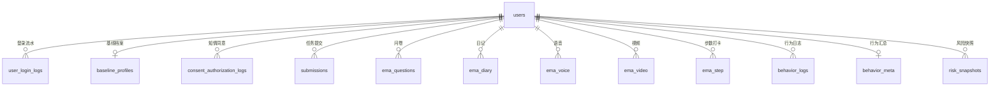

# EMA 项目数据库设计文档

> **数据库名**：`ema`  
> **建表脚本**：[`sql/02_create_tables.sql`](../sql/02_create_tables.sql)  
> **ORM 模型**：[`app/models/__init__.py`](../app/models/__init__.py)  
> **同步逻辑**：[`app/services/sync_service.py`](../app/services/sync_service.py)

本文档描述 EMA（生态瞬时评估）监测系统的 MySQL 表结构，共 **27 张表**，按业务分为 5 大模块。

---

## 一、总体架构

本项目是**心理健康 EMA 监测系统**：微信小程序采集多模态数据，FastAPI 服务端存储与分析，支撑依从性统计、风险预警与后续研究建模。



### 核心标识规则

| 规则     | 说明                                                                                         |
| -------- | -------------------------------------------------------------------------------------------- |
| 用户标识 | 同一微信 `openid` 可有多条参与记录（`users.id`）；业务数据以 `user_id` 关联                  |
| 研究编号 | 入组后绑定 `research_id`，全局唯一；退出研究后保留在当次参与记录上                           |
| 时间字段 | 双轨：**客户端毫秒时间戳**（`*_at_ms` / `client_at_ms`）+ **服务端入库时间**（`created_at`） |

### 数据写入方式

| 方式         | 说明                                                        |
| ------------ | ----------------------------------------------------------- |
| **实时 API** | 登录、知情同意、基线、各 EMA 任务 submit-log 等，提交即入库 |
| **批量同步** | `POST /api/v1/sync/push`，将小程序本地缓存批量上传          |

---

## 二、模块一：用户与授权（5 张表）

### 1. `users` — 研究参与者主表

**作用**：系统用户中心，关联所有业务数据。

**详细说明**：

- 首次微信登录（`wx-login`）时创建参与记录；同一 `openid` 退出后重新入组会新建一条 `users` 记录
- `research_id` 在用户完成基线测评后绑定，全局唯一；退出研究后**不清空**，保留在该次参与记录上
- `logout_at` 记录退出研究时间（与 `user_login_logs.logout_at` 小程序后台登出不同）
- `login_count` 累计登录次数
- `study_status` 研究状态（如 `active` / `exited`）
- `session_key` 保存微信 session，用于解密微信运动等 `encryptedData`

| 字段         | 类型                 | 说明                                      |
| ------------ | -------------------- | ----------------------------------------- |
| id           | BIGINT PK            | 参与记录主键（业务表均关联此 id）         |
| openid       | VARCHAR(64)          | 微信 openid（可重复，按 id 区分参与轮次） |
| research_id  | VARCHAR(64) UK, NULL | 研究编号                                  |
| login_count  | INT                  | 累计登录次数                              |
| study_status | VARCHAR(32)          | 研究状态                                  |
| session_key  | VARCHAR(128)         | 微信 session_key                          |
| logout_at    | DATETIME, NULL       | 退出研究时间                              |
| created_at   | DATETIME             | 创建时间                                  |
| updated_at   | DATETIME             | 最后更新时间                              |

**约束**：同一 `openid` 可有多条参与记录；`research_id` 全局唯一（每条参与记录最多绑定一个编号）。

**写入接口**：`POST /api/v1/auth/wx-login`、`POST /api/v1/auth/login-log`

---

### 2. `user_login_logs` — 用户登录流水

**作用**：记录每次微信登录，用于活跃度与登录行为分析。

**详细说明**：

- 每次调用 `wx-login` 或 `login-log` 接口写入一条
- 冗余存储 `openid`，便于按 openid 查询
- 当前实现为「仅记录登录」，无登出时间字段

| 字段      | 类型        | 说明          |
| --------- | ----------- | ------------- |
| id        | BIGINT PK   | 记录主键      |
| user_id   | BIGINT      | 关联 users.id |
| openid    | VARCHAR(64) | 登录时 openid |
| logged_at | DATETIME    | 登录时间      |

**索引**：`user_id`、`openid`、`(user_id, logged_at)`

---

### 3. `consent_authorization_logs` — 知情同意与授权流水（主表）

**作用**：记录用户同意或撤回知情同意/隐私授权的每一次操作。

**详细说明**：

- `status`：`accept`（同意）/ `revoke`（撤回）
- `event_info` JSON：来源页面、操作渠道等（如 `{ "source": "my", "page": "consent" }`）
- 用于判断用户当前是否已授权（取最新 accept 记录）

| 字段 | 类型 | 说明 |
| ---- | ---- | ---- |

| id | BIGINT PK | 记录主键 |
| user_id | BIGINT | 关联 users.id |
| openid | VARCHAR(64) | 冗余 openid |
| status | VARCHAR(16) | accept / revoke |
| event_info | JSON | 事件详情 |
| client_at_ms | BIGINT | 客户端操作时间 |
| created_at | DATETIME | 服务端入库时间 |

**写入接口**：`POST /api/v1/consent/accept-log`、`POST /api/v1/consent/revoke-log`

---

### 4. `consent_records` — 知情同意遗留记录

**作用**：兼容旧逻辑，记录退出研究等非 accept/revoke 操作。

**详细说明**：新流程以 `consent_authorization_logs` 为主；本表保留用于 `exit` 等场景。

| 字段         | 类型        | 说明          |
| ------------ | ----------- | ------------- |
| id           | BIGINT PK   | 记录主键      |
| user_id      | BIGINT      | 关联 users.id |
| action       | VARCHAR(16) | 如 exit       |
| client_at_ms | BIGINT      | 客户端时间    |
| created_at   | DATETIME    | 入库时间      |

---

### 5. `baseline_profiles` — 基线测评档案

**作用**：存储 onboarding 基线问卷，按题项分列，便于查询与风险建模。

**详细说明**：

- 每用户一条（UK: `user_id`）
- `research_id` 全局唯一，与 `users.research_id` 同步
- 涵盖：基本信息、学业压力、生活方式、PHQ/GAD/PSS/ISI/UCLA 筛查简版、风险信息

| 字段分组 | 主要字段                                                   |
| -------- | ---------------------------------------------------------- |
| 标识     | user_id, research_id                                       |
| 基本信息 | age, gender, grade, major, only_child, housing             |
| 学业压力 | course_pressure, exam_pressure, gpa_pressure, job_pressure |
| 生活方式 | sleep_habit, exercise_freq, social_freq                    |
| 筛查量表 | phq9_1, phq9_2, gad7_1, gad7_2, pss_1, isi_1, ucla_1       |
| 风险信息 | counsel_before, treatment_now, self_harm                   |
| 时间     | completed_at_ms, created_at, updated_at                    |

**写入接口**：`POST /api/v1/baseline/submit-log`；亦可通过 sync 同步

---

## 三、模块二：EMA 任务与提交数据（9 张表）

### 6. `submissions` — EMA 任务提交记录（通用 JSON 表）

**作用**：小程序本地提交的通用归档，以 JSON 存储各类型任务内容。

**详细说明**：

- 通过 `sync/push` 批量同步本地 `ema_submissions`
- `submission_type`：questionnaire / diary / voice / video / steps 等
- `payload` 为完整 JSON，灵活但查询需解析 JSON
- 与下方结构化表（`ema_questions` 等）**并行存在**：实时 API 写结构化表，sync 写本表

| 字段            | 类型        | 说明           |
| --------------- | ----------- | -------------- |
| id              | BIGINT PK   | 提交主键       |
| user_id         | BIGINT      | 关联 users.id  |
| submission_type | VARCHAR(32) | 任务类型       |
| task_date       | VARCHAR(16) | YYYY-MM-DD     |
| session_id      | INT         | 当日第几轮打卡 |
| payload         | JSON        | 提交内容       |
| client_at_ms    | BIGINT      | 客户端提交时间 |
| created_at      | DATETIME    | 服务端入库时间 |

**唯一约束**：`(user_id, submission_type, task_date, session_id, client_at_ms)`

---

### 7. `ema_questions` — 每日 EMA 问卷

**作用**：结构化存储每日 8 项量表 + 消极想法筛查。

**详细说明**：

- 各维度独立列（0–10 整数），便于 SQL 统计与建模
- `negative`：是 / 否 / 不愿回答

| 字段                                                    | 类型        | 说明         |
| ------------------------------------------------------- | ----------- | ------------ |
| mood, stress, anxiety, lonely, sleep, fatigue, function | INT         | 0–10 量表    |
| negative                                                | VARCHAR(16) | 消极想法筛查 |
| answered_at_ms                                          | BIGINT      | 答题时间     |
| openid                                                  | VARCHAR(64) | 冗余 openid  |

**写入接口**：`POST /api/v1/ema/questionnaire/submit-log`

---

### 8. `ema_diary` — 文本日记

**作用**：存储每日文本日记正文与字数，供 NLP 特征提取。

| 字段          | 类型        | 说明        |
| ------------- | ----------- | ----------- |
| text          | TEXT        | 日记正文    |
| length        | INT         | 字数        |
| written_at_ms | BIGINT      | 提交时间    |
| openid        | VARCHAR(64) | 冗余 openid |

**写入接口**：`POST /api/v1/ema/diary/submit-log`

---

### 9. `ema_voice` — 语音录音记录

**作用**：存储语音任务元数据；音频文件存于服务端 `files/voice/` 目录。

| 字段           | 类型         | 说明                       |
| -------------- | ------------ | -------------------------- |
| duration_sec   | INT          | 录音时长（秒），跳过时为 0 |
| skip           | TINYINT(1)   | 是否跳过：0 否 / 1 是      |
| file_name      | VARCHAR(255) | 文件名，跳过时为空         |
| recorded_at_ms | BIGINT       | 录音时间                   |
| openid         | VARCHAR(64)  | 冗余 openid                |

**写入接口**：`POST /api/v1/ema/voice/submit-log`（multipart 上传）

---

### 10. `ema_video` — 视频录制记录

**作用**：存储视频任务元数据；视频文件存于服务端 `files/video/` 目录。

字段与 `ema_voice` 类似。

**写入接口**：`POST /api/v1/ema/video/submit-log`（multipart 上传）

---

### 11. `daily_task_snapshots` — 每日任务完成快照

**作用**：同步小程序当日各任务完成状态，支撑首页展示与依从性统计。

**详细说明**：

- 来源：本地 `ema_daily_tasks` → sync
- 每用户每天一条；`tasks` JSON 记录 questionnaire / diary / voice / video / steps 等完成情况

| 字段          | 类型        | 说明               |
| ------------- | ----------- | ------------------ |
| task_date     | VARCHAR(16) | 日期               |
| tasks         | JSON        | 各任务完成状态     |
| updated_at_ms | BIGINT      | 客户端最后更新时间 |

**唯一约束**：`(user_id, task_date)`

---

### 12. `steps_records` — 每日步数记录（sync 路径）

**作用**：通过 sync 同步的步数历史，按日一条。

**详细说明**：来源为本地 `ema_steps_history`；与 `ema_step` 为不同写入路径。

| 字段         | 类型        | 说明     |
| ------------ | ----------- | -------- |
| task_date    | VARCHAR(16) | 日期     |
| steps        | INT         | 当日步数 |
| client_at_ms | BIGINT      | 记录时间 |

**唯一约束**：`(user_id, task_date)`

---

### 13. `ema_step` — 步数打卡记录（API 路径）

**作用**：通过 submit-log 实时提交的步数打卡。

| 字段           | 类型        | 说明                  |
| -------------- | ----------- | --------------------- |
| steps          | INT         | 当日步数              |
| source         | VARCHAR(16) | werun / manual / mock |
| recorded_at_ms | BIGINT      | 提交时间              |
| openid         | VARCHAR(64) | 冗余 openid           |

**写入接口**：`POST /api/v1/ema/step/submit-log`

---

### 14. `skip_events` — 媒体任务跳过事件

**作用**：记录语音/视频被跳过的次数、原因与时间，反映依从性与参与质量。

**详细说明**：

- `media_type`：video / voice
- 来源：sync 同步 `ema_video_skips` / `ema_voice_skips`
- 服务端风险预警：跳过 ≥3 次触发告警

| 字段         | 类型        | 说明                |
| ------------ | ----------- | ------------------- |
| media_type   | VARCHAR(16) | video / voice       |
| task_date    | VARCHAR(16) | 任务日期            |
| session_id   | INT         | 会话编号            |
| reason       | VARCHAR(64) | 跳过原因，默认 skip |
| client_at_ms | BIGINT      | 跳过时间            |

**唯一约束**：`(user_id, media_type, client_at_ms)`

---

## 四、模块三：打卡会话与行为追踪（5 张表）

### 15. `checkin_day_states` — 当日打卡状态

**作用**：记录用户某天的打卡会话状态（当前 session、各任务进度等）。

**详细说明**：

- 来源：sync 同步 `ema_checkin_day`
- 每用户每天一条；`state_data` 为完整 JSON 快照

| 字段          | 类型        | 说明          |
| ------------- | ----------- | ------------- |
| task_date     | VARCHAR(16) | 任务日期      |
| session_id    | INT         | 当前会话编号  |
| state_data    | JSON        | 打卡状态 JSON |
| updated_at_ms | BIGINT      | 状态更新时间  |

**唯一约束**：`(user_id, task_date)`

---

### 16. `checkin_sessions` — 打卡会话明细

**作用**：记录每次打卡会话的开始与完成时间，分析单次参与时长与完成率。

| 字段            | 类型        | 说明                    |
| --------------- | ----------- | ----------------------- |
| session_id      | INT         | 当日第几轮              |
| started_at_ms   | BIGINT      | 开始时间                |
| completed_at_ms | BIGINT NULL | 完成时间，未完成为 NULL |

从 `checkin_day.sessions` 同步写入。

**唯一约束**：`(user_id, task_date, session_id)`

---

### 17. `video_done_events` — 视频完成事件

**作用**：记录用户完成视频任务的时间点，辅助视频依从性统计。

**详细说明**：来源为 sync 同步 `ema_video_dates`（时间戳数组）。

| 字段         | 类型   | 说明             |
| ------------ | ------ | ---------------- |
| client_at_ms | BIGINT | 完成时间（毫秒） |

---

### 18. `behavior_logs` — 用户行为日志（明细）

**作用**：逐条记录页面浏览、按钮点击、任务提交、任务耗时等行为事件。

**详细说明**：

- 小程序 `trackEvent()` 写入本地 `ema_behavior_logs`（最多 800 条）
- sync 批量 upsert 到本表
- 供行为轨迹回放、后续 `behavior_features` 聚合

| 字段         | 类型         | 说明                                                        |
| ------------ | ------------ | ----------------------------------------------------------- |
| module       | VARCHAR(32)  | 模块：app / home / questionnaire / diary / voice / video 等 |
| action       | VARCHAR(64)  | 动作：view / submit / app_launch / task_duration 等         |
| extra        | JSON         | 附加参数                                                    |
| route        | VARCHAR(128) | 页面路由                                                    |
| hour         | INT          | 发生时刻（0–23）                                            |
| client_at_ms | BIGINT       | 客户端时间                                                  |

**唯一约束**：`(user_id, module, action, client_at_ms)`

**示例记录**：

```
module=checkin, action=session_complete,
extra={"date":"2026-06-04","sessionId":1},
route=pages/ema/steps/index, hour=9
```

---

### 19. `behavior_meta` — 行为采集元信息（汇总）

**作用**：存储行为埋点的**汇总 JSON**，与 `behavior_logs` 互补，减少重复计算。

**详细说明**：

- 每用户一条；sync 时用客户端最新 JSON **整包覆盖** `meta_data`
- 客户端 `updateMeta()` 实时维护

**`meta_data` 主要字段**：

| 字段            | 含义                             |
| --------------- | -------------------------------- |
| openCount       | 小程序打开次数                   |
| checkinTimes    | 问卷提交记录（时间、小时、轮次） |
| checkinSessions | 完成打卡轮次记录                 |
| recheckinCount  | 补打卡次数                       |
| diaryWordCounts | 每次日记字数                     |
| voiceDurations  | 每次语音时长（秒）               |
| videoDurations  | 每次视频时长（秒）               |
| taskDurations   | 各任务耗时                       |

**用途**：「我的」页统计、使用行为详情页、趋势/风险分析的快速指标。

| 字段          | 类型   | 说明       |
| ------------- | ------ | ---------- |
| meta_data     | JSON   | 汇总元信息 |
| updated_at_ms | BIGINT | 更新时间   |

**唯一约束**：`(user_id)` — 每用户一条

---

## 五、模块四：多模态特征（4 张表，分析流水线预留）

> **状态**：表已建，分析任务入队逻辑在 `app/services/analysis/`，实际 NLP / 声学 / 视觉 pipeline 待实现。

### 20. `text_features` — 文本特征

**作用**：存储问卷/日记经 NLP 提取的特征向量，供风险模型输入。

| 字段          | 类型        | 说明                      |
| ------------- | ----------- | ------------------------- |
| task_date     | VARCHAR(16) | 任务日期 YYYY-MM-DD       |
| session_id    | INT         | 当日第几次打卡会话        |
| submission_id | BIGINT NULL | 关联 submissions.id，可空 |
| status        | VARCHAR(16) | pending / done / failed   |
| features      | JSON        | 提取的特征                |

**索引**：`(user_id, task_date)`

---

### 21. `voice_features` — 语音特征

**作用**：存储语音声学分析特征，用于情绪与风险相关建模。

字段结构同 `text_features`（含 `task_date`、`session_id`）。

---

### 22. `video_features` — 视频特征

**作用**：存储视频/面部分析特征，供多模态融合分析。

字段结构同 `text_features`（含 `task_date`、`session_id`）。

---

### 23. `behavior_features` — 行为特征

**作用**：由 `behavior_logs` + `behavior_meta` 聚合计算的行为模式特征。

| 字段        | 类型        | 说明                    |
| ----------- | ----------- | ----------------------- |
| task_date   | VARCHAR(16) | 任务日期 YYYY-MM-DD     |
| session_id  | INT         | 当日第几次打卡会话      |
| status      | VARCHAR(16) | pending / done / failed |
| features    | JSON        | 聚合特征                |
| computed_at | DATETIME    | 计算完成时间            |

反映使用规律、打卡时段、缺测模式等；按 `user_id + task_date + session_id` 区分每轮会话。

---

## 六、模块五：风险预警与反馈（3 张表）

### 24. `risk_snapshots` — 风险评估快照

**作用**：保存当前风险、7 天预测、异常预警等评估结果，供趋势页与历史追溯。

**详细说明**：

- 调用 `GET /api/v1/risk/assessment` 时写入
- `snapshot_type`：current / forecast / alerts
- `result_data` JSON 存完整评估结果

| 字段           | 类型        | 说明     |
| -------------- | ----------- | -------- |
| snapshot_type  | VARCHAR(32) | 快照类型 |
| result_data    | JSON        | 评估结果 |
| computed_at_ms | BIGINT      | 计算时间 |

---

### 25. `feedback_records` — 非诊断性反馈记录

**作用**：记录向用户推送的自助建议、资源推荐（强调非临床诊断性质）。

**详细说明**：

- 接口：`GET /api/v1/feedback`
- `feedback_type` 默认 `non_diagnostic`
- `content` JSON 存反馈正文与推荐资源

---

### 26. `referral_records` — 高风险转介记录

**作用**：记录需人工跟进的高风险个案，供研究团队或咨询师处理。

| 字段           | 类型        | 说明                 |
| -------------- | ----------- | -------------------- |
| risk_level     | VARCHAR(16) | 触发转介时的风险等级 |
| status         | VARCHAR(16) | pending / handled 等 |
| note           | TEXT        | 备注说明             |
| referred_at_ms | BIGINT      | 转介时间             |

高风险评估时由 `feedback_service` 自动创建。

---

## 七、数据流与映射

### 小程序本地存储 → 服务端表（sync/push）

| 本地 Key                          | 服务端表                              |
| --------------------------------- | ------------------------------------- |
| ema_baseline                      | baseline_profiles                     |
| ema_submissions                   | submissions                           |
| ema_daily_tasks（已移除）         | daily_task_snapshots                  |
| ema_steps_history（已移除）       | steps_records                         |
| ema_video_skips / ema_voice_skips | skip_events                           |
| ema_checkin_day                   | checkin_day_states + checkin_sessions |
| ema_video_dates                   | video_done_events                     |
| ema_behavior_logs                 | behavior_logs                         |
| ema_behavior_meta                 | behavior_meta                         |

### 实时 API → 结构化表

| 接口                                      | 目标表                               |
| ----------------------------------------- | ------------------------------------ |
| POST /api/v1/auth/wx-login                | users, user_login_logs               |
| POST /api/v1/consent/accept-log           | consent_authorization_logs           |
| POST /api/v1/consent/revoke-log           | consent_authorization_logs           |
| POST /api/v1/baseline/submit-log          | baseline_profiles, users.research_id |
| POST /api/v1/ema/questionnaire/submit-log | ema_questions                        |
| POST /api/v1/ema/diary/submit-log         | ema_diary                            |
| POST /api/v1/ema/voice/submit-log         | ema_voice                            |
| POST /api/v1/ema/video/submit-log         | ema_video                            |
| POST /api/v1/ema/step/submit-log          | ema_step                             |
| GET /api/v1/risk/assessment               | risk_snapshots                       |
| GET /api/v1/feedback                      | feedback_records, referral_records   |

---

## 八、表清单速查

| #   | 表名                       | 模块 | 状态 | 一句话                         |
| --- | -------------------------- | ---- | ---- | ------------------------------ |
| 1   | users                      | 用户 | 已用 | 用户主表，openid + research_id |
| 2   | user_login_logs            | 用户 | 已用 | 登录流水                       |
| 3   | consent_authorization_logs | 授权 | 已用 | 知情同意/撤回流水/退出研究     |
| 4   | consent_records            | 授权 | 遗留 | 旧版同意记录                   |
| 5   | baseline_profiles          | 授权 | 已用 | 基线测评档案                   |
| 6   | submissions                | EMA  | 已用 | 通用任务提交 JSON              |
| 7   | ema_questions              | EMA  | 已用 | 每日问卷结构化                 |
| 8   | ema_diary                  | EMA  | 已用 | 文本日记                       |
| 9   | ema_voice                  | EMA  | 已用 | 语音录音元数据                 |
| 10  | ema_video                  | EMA  | 已用 | 视频录制元数据                 |
| 11  | daily_task_snapshots       | EMA  | 已用 | 每日任务完成快照               |
| 12  | steps_records              | EMA  | 遗留 | 步数（sync）                   |
| 13  | ema_step                   | EMA  | 已用 | 步数（API）                    |
| 14  | skip_events                | EMA  | 已用 | 语音/视频跳过                  |
| 15  | checkin_day_states         | 打卡 | 已用 | 当日打卡状态                   |
| 16  | checkin_sessions           | 打卡 | 已用 | 打卡会话明细                   |
| 17  | video_done_events          | 打卡 | 已用 | 视频完成事件                   |
| 18  | behavior_logs              | 行为 | 已用 | 行为明细日志                   |
| 19  | behavior_meta              | 行为 | 已用 | 行为汇总 JSON                  |
| 20  | text_features              | 分析 | 预留 | 文本 NLP 特征                  |
| 21  | voice_features             | 分析 | 预留 | 语音声学特征                   |
| 22  | video_features             | 分析 | 预留 | 视频视觉特征                   |
| 23  | behavior_features          | 分析 | 预留 | 行为聚合特征                   |
| 24  | risk_snapshots             | 风险 | 已用 | 风险评估快照                   |
| 25  | feedback_records           | 风险 | 已用 | 非诊断反馈                     |
| 26  | referral_records           | 风险 | 已用 | 高风险转介                     |

---

## 九、设计说明与待办

### 双轨存储

部分 EMA 数据存在两条写入路径：

- **结构化表**（`ema_questions` 等）：实时 API，列式存储，便于分析
- **通用表**（`submissions`）：sync 批量同步，JSON 灵活归档

研究分析时建议以结构化表为主，`submissions` 作备份与对账。

### 步数双表

- `steps_records`：sync 路径，按日 upsert
- `ema_step`：API 路径，每次提交一条流水

### 已知差异

| 设计意图      | 当前实现                      | 说明             |
| ------------- | ----------------------------- | ---------------- |
| 登录/登出流水 | 仅 `user_login_logs`（登录）  | 登出时间尚未实现 |
| 单一行为表    | behavior_logs + behavior_meta | 明细与汇总并存   |

### 建库步骤

```bash
# 1. 创建数据库
mysql -u root -p < sql/01_create_database.sql

# 2. 建表
mysql -u root -p ema < sql/02_create_tables.sql
```

---

_文档版本与建表脚本 `02_create_tables.sql` 保持一致。表结构变更时请同步更新本文件与 ORM 模型。_
