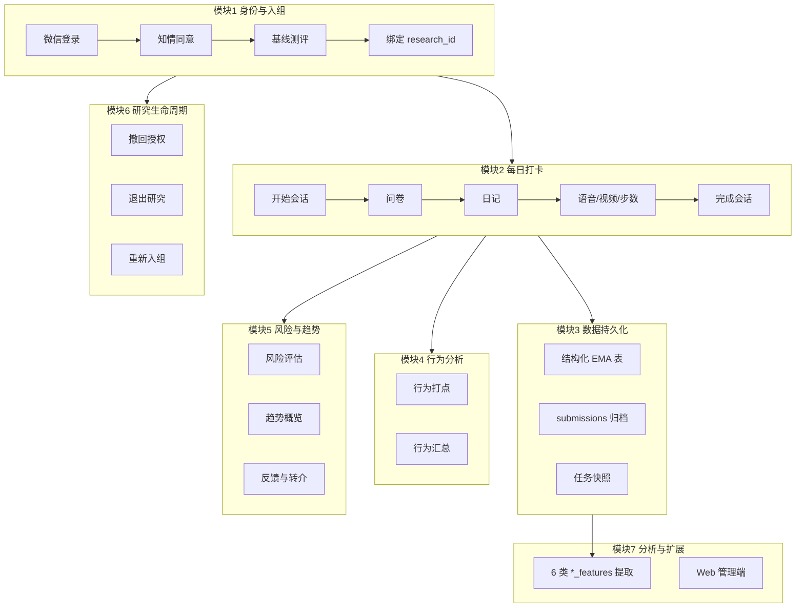
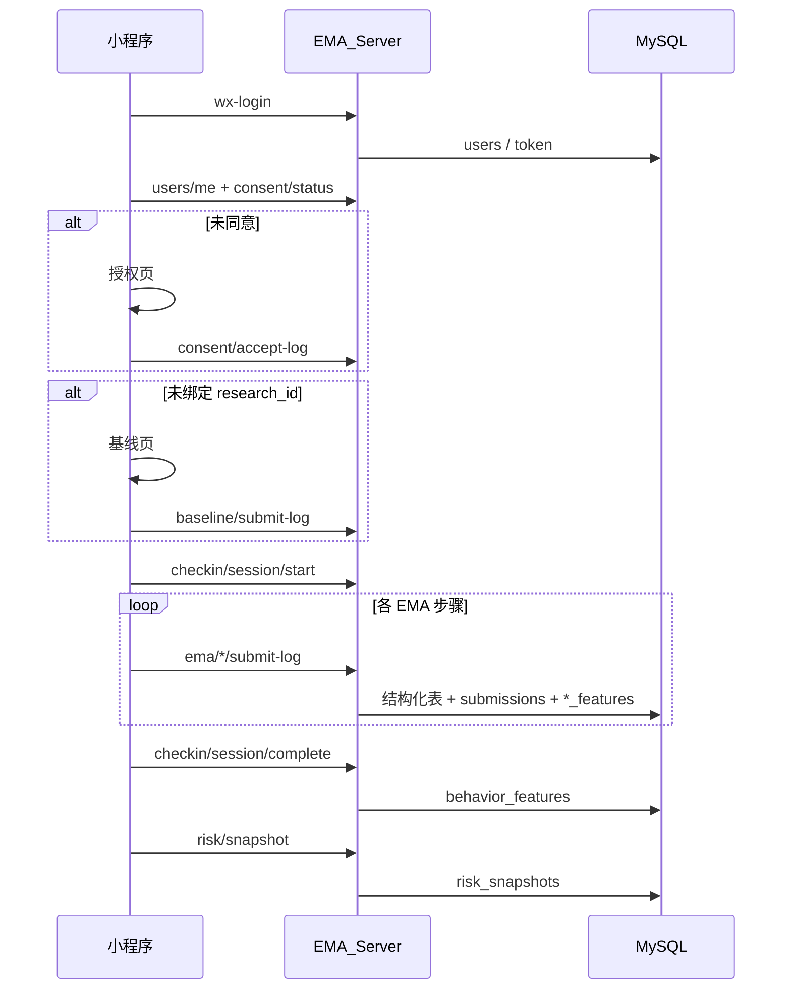

# EMA 项目架构与业务说明

> **项目名称**：心理健康 EMA（Ecological Momentary Assessment，生态瞬时评估）监测系统  
> **数据库名**：`ema`  
> **技术栈**：微信小程序 + FastAPI + MySQL +（预留 Vue Web 管理端）  
> **建库脚本**：[`EMA_Server/sql/01_create_database.sql`](../EMA_Server/sql/01_create_database.sql)  
> **建表脚本**：[`EMA_Server/sql/02_create_tables.sql`](../EMA_Server/sql/02_create_tables.sql)  
> **ORM 模型**：[`EMA_Server/app/models/__init__.py`](../EMA_Server/app/models/__init__.py)

---

## 一、项目总体说明

本系统面向研究场景下的**心理健康纵向监测**：通过微信小程序完成每日打卡与多模态 EMA 任务（问卷、日记、语音、视频、步数），服务端持久化数据，支撑依从性统计、趋势展示、风险预警与后续研究建模。

### 1.1 子项目划分

| 子项目         | 目录               | 主要职责                                                    |
| -------------- | ------------------ | ----------------------------------------------------------- |
| **EMA_WeChat** | 微信小程序         | 被试端：登录、知情同意、基线、每日打卡、记录/趋势/资源/我的 |
| **EMA_Server** | Python 后端        | 数据入库、身份鉴权、同步、风险评估、反馈与 Web API          |
| **EMA_Web**    | Vue 管理端（预留） | 研究人员录入反馈、后台管理（当前 API 已预留）               |

### 1.2 核心标识规则

| 概念            | 说明                                                                   |
| --------------- | ---------------------------------------------------------------------- |
| **openid**      | 微信用户标识；同一 openid 可有多条 **参与记录**                        |
| **user_id**     | `users.id`，**业务数据主关联键**；JWT 携带 `uid`                       |
| **research_id** | 研究编号；入组基线时绑定；同一编号可出现在多轮参与记录中（索引非唯一） |
| **task_date**   | 任务日期，`YYYY-MM-DD`                                                 |
| **session_id**  | 当日第几次打卡会话（从 1 递增，支持重新打卡）                          |
| **时间字段**    | 统一为 `DATETIME`（如 `client_at`、`logged_at`）；部分接口兼容毫秒入参 |

### 1.3 数据写入方式

| 方式         | 典型场景                                                           |
| ------------ | ------------------------------------------------------------------ |
| **实时 API** | 登录、知情同意、基线、各 EMA 步骤 submit-log、打卡会话、行为打点   |
| **批量同步** | `POST /api/v1/sync/push`：consent、baseline、步数历史、跳过记录、打卡日状态等（见第六节） |
| **拉取恢复** | `GET /api/v1/sync/pull`、登录后 `/users/me` + `/consent/status`    |

---

## 二、业务模块拆解

系统按被试使用流程与后端职责，分为 **7 大业务模块**。



---

### 模块 1：身份认证与入组（Onboarding）

**主要功能**

- 微信 `code` 换 `openid`，签发 JWT（含 `user_id`）
- 小程序前台/后台记录登录、登出流水
- 知情同意与授权：同意 / 撤回 / 退出研究
- 基线问卷：基本信息 + 学业/生活/量表题，绑定 `research_id`
- 登录后按服务端状态跳转：未同意 → 授权页；未绑定编号 → 基线页

**涉及表**

`users`、`user_login_logs`、`consent_authorization_logs`、`consent_records`（遗留）、`baseline_profiles`

**主要 API**

| 接口                               | 说明                                           |
| ---------------------------------- | ---------------------------------------------- |
| `POST /api/v1/auth/wx-login`       | 微信登录，创建/获取 active 参与记录            |
| `POST /api/v1/auth/login-log`      | 进入前台，写登录流水、`login_count+1`          |
| `POST /api/v1/auth/logout-log`     | 进入后台，更新最近登录记录的 `logout_at`       |
| `GET /api/v1/users/me`             | 当前用户资料、是否已同意/已完成基线            |
| `GET /api/v1/consent/status`       | 从 `consent_authorization_logs` 读最新授权状态 |
| `POST /api/v1/consent/accept-log`  | 记录同意                                       |
| `POST /api/v1/consent/revoke-log`  | 记录撤回                                       |
| `POST /api/v1/consent/exit-log`    | 记录退出研究                                   |
| `POST /api/v1/baseline/submit-log` | 提交基线并绑定 `research_id`                   |

**参与记录生命周期要点**

- 退出研究：`study_status=exited`，写入 `users.logout_at`，**保留** `research_id`
- 退出后重新登录：若无非 exited 的 active 记录，**新建**一条 `users` 行
- 重新绑定相同 `research_id`：在**当前登录已创建**的参与记录上更新 `research_id`，不再额外新建；历史参与记录保持不变

**小程序页面**

`pages/onboarding/consent`、`pages/onboarding/baseline`

---

### 模块 2：每日 EMA 打卡（Check-in Flow）

**主要功能**

- 首页展示当日任务进度（问卷、日记、语音、视频、步数）
- 支持「重新打卡」：同一 `task_date` 下 `session_id` 递增
- 开始/完成打卡会话，记录会话起止时间
- 各 EMA 步骤完成后**实时提交**（非仅依赖登录时 bulk sync）
- 语音/视频支持跳过，跳过也写入提交记录

**涉及表**

`checkin_sessions`、`checkin_day_states`、`daily_task_snapshots`、`skip_events`、`submissions` 及模块 3 各结构化表

**主要 API**

| 接口                                        | 说明                                 |
| ------------------------------------------- | ------------------------------------ |
| `POST /api/v1/checkin/session/start`        | 开始一轮打卡                         |
| `POST /api/v1/checkin/session/complete`     | 完成一轮打卡（**触发 behavior_features 提取**） |
| `GET /api/v1/daily-tasks`                   | 读取 `daily_task_snapshots` 任务进度            |
| `POST /api/v1/ema/submission/submit`        | 统一步骤提交入口                                |
| `POST /api/v1/ema/questionnaire/submit-log` | 每日 8 项问卷 → `questions_features`            |
| `POST /api/v1/ema/diary/submit-log`         | 文本日记 → `text_features`                      |
| `POST /api/v1/ema/voice/submit-log`         | 语音（multipart）→ `voice_features`             |
| `POST /api/v1/ema/video/submit-log`         | 视频（multipart）→ `video_features`             |
| `POST /api/v1/ema/step/submit-log`          | 步数打卡 → `step_features`                      |
| `POST /api/v1/steps/werun`                  | 解密微信运动步数                                |

**小程序页面**

`pages/home`、`pages/ema/questionnaire|diary|voice|video|steps`

---

### 模块 3：EMA 数据持久化（Storage Layer）

**主要功能**

- **结构化表**：列式存储，便于 SQL 统计与建模（主分析路径）
- **submissions 表**：JSON 归档，兼容 sync 与统一步骤提交
- **daily_task_snapshots**：按 `user_id + task_date + session_id` 维护任务完成快照
- 双轨并存：实时 API 写结构化表 + submissions；部分历史数据仍走 sync

**涉及表**

`submissions`、`ema_questions`、`ema_diary`、`ema_voice`、`ema_video`、`ema_step`、`steps_records`、`daily_task_snapshots`、`skip_events`

---

### 模块 4：行为追踪（Behavior Tracking）

**主要功能**

- 页面浏览、按钮点击、任务耗时等行为事件打点
- 明细写入 `behavior_logs`（**主路径**：实时 `POST /behavior/track-log`）
- 汇总 JSON 写入 `behavior_meta`（打开次数、打卡时段、各任务耗时等）
- 打卡完成时聚合为 `behavior_features`（`BehaviorFeatureExtractor`）
- 「我的 → 使用行为详情」展示统计

**涉及表**

`behavior_logs`、`behavior_meta`

**主要 API**

`POST /api/v1/behavior/track-log`（实时）；`sync/push` 的 `behavior_logs` / `behavior_meta` 为批量补传预留

---

### 模块 5：风险预警、趋势与反馈（Risk & Trends）

**主要功能**

- 打卡完成后计算当前风险、预测与异常项，写入 `risk_snapshots`
- 趋势 Tab 聚合问卷/步数/跳过等数据展示概览
- 非诊断性反馈文案与校园资源列表
- 高风险转介：`referral_records` 表已建，**自动写入逻辑预留**（供 Web 管理端人工跟进）

**涉及表**

`risk_snapshots`、`feedback_records`、`referral_records`

**主要 API**

| 接口                          | 说明         |
| ----------------------------- | ------------ |
| `GET /api/v1/risk/assessment` | 风险评估     |
| `POST /api/v1/risk/snapshot`  | 保存风险快照 |
| `GET /api/v1/trends/overview` | 趋势页数据   |
| `GET /api/v1/feedback`        | 获取反馈     |
| `GET /api/v1/resources`       | 校园资源     |

**小程序页面**

`pages/trends`、`pages/resources`、`pages/records`

---

### 模块 6：研究生命周期（Study Lifecycle）

**主要功能**

- **撤回授权**：停止新采集，需重新同意
- **退出研究**：清本地缓存、重新登录；服务端标记 exited，保留当次 `research_id` 与历史数据
- **重新入组**：新参与记录 + 重新同意 + 基线；可绑定相同或新的 `research_id`

**状态枚举（users.study_status）**

| 值                | 含义       |
| ----------------- | ---------- |
| `active`          | 正常参与中 |
| `consent_revoked` | 已撤回授权 |
| `exited`          | 已退出研究 |

---

### 模块 7：多模态分析与 Web 扩展

**主要功能**

- **6 类特性提取**（`app/services/analysis/`）：问卷 EMA、文本、语音、视频、步数、行为；EMA 提交后自动触发，也可通过 `/api/v1/analysis/*` 手动补跑
- 各 `*_features` 表按 `(user_id, task_date, session_id)` 与原始 EMA 对齐
- Web 端录入反馈：`POST /api/web/v1/feedback`（已实现路由，管理端 UI 预留）

**涉及表**

`questions_features`、`text_features`、`voice_features`、`video_features`、`step_features`、`behavior_features`

**自动触发时机**

| 特性表               | 触发点                          |
| -------------------- | ------------------------------- |
| `questions_features` | 问卷 `submit-log` 后            |
| `text_features`      | 日记 `submit-log` 后            |
| `voice_features`     | 语音 `submit-log` 后            |
| `video_features`     | 视频 `submit-log` 后            |
| `step_features`      | 步数 `submit-log` 后            |
| `behavior_features`  | 打卡 `session/complete` 后      |

配置项见 [`EMA_Server/.env.example`](../EMA_Server/.env.example) 与 [README](../EMA_Server/README.md#预留功能模块)。

---

## 三、数据库表设计（共 28 张表）

### 3.1 表与模块对照总览

| #   | 表名                         | 所属模块   | 状态 | 一句话                                         |
| --- | ---------------------------- | ---------- | ---- | ---------------------------------------------- |
| 1   | `users`                      | 身份与入组 | 已用 | 参与记录主表，openid + research_id + 研究状态  |
| 2   | `user_login_logs`            | 身份与入组 | 已用 | 每次进入前台一条登录流水，后台更新 logout_at   |
| 3   | `consent_authorization_logs` | 身份与入组 | 已用 | 同意/撤回/退出授权流水（主表）                 |
| 4   | `consent_records`            | 身份与入组 | 遗留 | 旧版 consent，新流程以 authorization_logs 为主 |
| 5   | `baseline_profiles`          | 身份与入组 | 已用 | 基线问卷档案，每 user_id 一条                  |
| 6   | `submissions`                | EMA 持久化 | 已用 | 通用任务提交 JSON 归档                         |
| 7   | `ema_questions`              | EMA 持久化 | 已用 | 每日问卷 8 项量表 + 消极想法                   |
| 8   | `ema_diary`                  | EMA 持久化 | 已用 | 文本日记正文与字数                             |
| 9   | `ema_voice`                  | EMA 持久化 | 已用 | 语音任务元数据（文件存 files/voice/）          |
| 10  | `ema_video`                  | EMA 持久化 | 已用 | 视频任务元数据（文件存 files/video/）          |
| 11  | `daily_task_snapshots`       | EMA 持久化 | 已用 | 每日各任务完成状态 JSON 快照                   |
| 12  | `steps_records`              | EMA 持久化 | 遗留 | sync 路径同步的按日步数                        |
| 13  | `ema_step`                   | EMA 持久化 | 已用 | API 路径步数打卡流水                           |
| 14  | `skip_events`                | EMA 持久化 | 已用 | 语音/视频跳过事件                              |
| 15  | `checkin_day_states`         | 打卡会话   | 已用 | 当日打卡整体状态 JSON                          |
| 16  | `checkin_sessions`           | 打卡会话   | 已用 | 每轮打卡开始/完成时间                          |
| 17  | `video_done_events`          | 打卡会话   | 已用 | 视频完成时间点（sync）                         |
| 18  | `behavior_logs`              | 行为追踪   | 已用 | 行为事件明细                                   |
| 19  | `behavior_meta`              | 行为追踪   | 已用 | 行为汇总 JSON，每 user 一条                    |
| 20  | `text_features`              | 分析扩展   | 已用 | 日记 NLP / 语义特征                            |
| 21  | `voice_features`             | 分析扩展   | 已用 | 语音声学 + 转写特征                            |
| 22  | `video_features`             | 分析扩展   | 已用 | 视频 / 面部视觉特征                            |
| 23  | `behavior_features`          | 分析扩展   | 已用 | 行为聚合特征（打卡完成时计算）                 |
| 24  | `questions_features`         | 分析扩展   | 已用 | 问卷 7 维 EMA 趋势 + 消极想法统计              |
| 25  | `step_features`              | 分析扩展   | 已用 | 步数个体化基线偏离特征                         |
| 26  | `risk_snapshots`             | 风险反馈   | 已用 | 风险评估快照（含 task_date/session_id）        |
| 27  | `feedback_records`           | 风险反馈   | 已用 | 非诊断性反馈                                   |
| 28  | `referral_records`           | 风险反馈   | 预留 | 高风险转介（表已建，自动写入待接入）           |

---

### 3.2 模块一：用户与授权（5 张表）

#### `users` — 研究参与者主表

| 项目         | 说明                                                                                    |
| ------------ | --------------------------------------------------------------------------------------- |
| **作用**     | 系统用户中心；每条记录代表一轮「参与」；所有业务表通过 `user_id` 关联                   |
| **关键字段** | `openid`、`research_id`、`study_status`、`login_count`、`session_key`、`logout_at`      |
| **约束**     | 同一 `openid` 可多行；`research_id` 有索引（非全局唯一，支持多轮同编号）                |
| **写入**     | `wx-login` 创建/获取 active 行；`baseline/submit-log` 绑定编号；`consent/exit` 标记退出 |

#### `user_login_logs` — 登录流水

| 项目         | 说明                                                          |
| ------------ | ------------------------------------------------------------- |
| **作用**     | 记录小程序进入前台/后台的登录会话，用于活跃度分析             |
| **关键字段** | `user_id`、`openid`、`logged_at`、`logout_at`                 |
| **写入**     | 进入前台 `login-log` 新增；进入后台 `logout-log` 更新最近一条 |

#### `consent_authorization_logs` — 知情同意与授权流水

| 项目         | 说明                                                                           |
| ------------ | ------------------------------------------------------------------------------ |
| **作用**     | 同意、撤回、退出研究的权威流水；`/consent/status` 取最新一条判断 `has_consent` |
| **关键字段** | `status`（accept/revoke/exit）、`event_info` JSON、`client_at`                 |
| **写入**     | `consent/accept-log`、`revoke-log`、`exit-log`                                 |

#### `consent_records` — 遗留同意表

| 项目     | 说明                                                   |
| -------- | ------------------------------------------------------ |
| **作用** | 兼容旧逻辑；新流程以 `consent_authorization_logs` 为准 |
| **建议** | 后续可评估删除                                         |

#### `baseline_profiles` — 基线测评档案

| 项目         | 说明                                                                          |
| ------------ | ----------------------------------------------------------------------------- |
| **作用**     | 存储 onboarding 基线：人口学、学业压力、生活方式、PHQ/GAD 等简版筛查          |
| **关键字段** | `user_id`（唯一）、`research_id`、`age`、`gender`、各量表题项、`completed_at` |
| **写入**     | `baseline/submit-log`；每轮参与新建档案（新 user_id）                         |

---

### 3.3 模块二：EMA 任务与提交（9 张表）

#### `submissions` — 通用提交归档

| 项目         | 说明                                                                 |
| ------------ | -------------------------------------------------------------------- |
| **作用**     | 以 JSON 存储各类型任务提交，统一步骤接口与 sync 均可写入             |
| **关键字段** | `submission_type`、`task_date`、`session_id`、`payload`、`client_at` |
| **唯一**     | `(user_id, submission_type, task_date, session_id, client_at)`       |

#### `ema_questions` — 每日 EMA 问卷

| 项目         | 说明                                                                                             |
| ------------ | ------------------------------------------------------------------------------------------------ |
| **作用**     | 结构化 8 维 0–10 分 + 消极想法筛查                                                               |
| **关键字段** | `mood`、`stress`、`anxiety`、`lonely`、`sleep`、`fatigue`、`function`、`negative`、`answered_at` |

#### `ema_diary` — 文本日记

| 项目         | 说明                                        |
| ------------ | ------------------------------------------- |
| **作用**     | 30–100 字日记，供后续 NLP / `text_features` |
| **关键字段** | `text`、`length`、`written_at`              |

#### `ema_voice` / `ema_video` — 语音与视频

| 项目         | 说明                                               |
| ------------ | -------------------------------------------------- |
| **作用**     | 录音/录像元数据；媒体文件存服务器目录              |
| **关键字段** | `duration_sec`、`skip`、`file_name`、`recorded_at` |

#### `daily_task_snapshots` — 每日任务快照

| 项目     | 说明                                      |
| -------- | ----------------------------------------- |
| **作用** | 首页任务进度；每步完成后更新 `tasks` JSON |
| **唯一** | `(user_id, task_date, session_id)`        |

#### `steps_records` — 步数（sync 路径）

| 项目     | 说明                                               |
| -------- | -------------------------------------------------- |
| **作用** | sync 同步的历史步数，按日一条                      |
| **说明** | 与 `ema_step` 双轨；新流程以 API + `ema_step` 为主 |

#### `ema_step` — 步数（API 路径）

| 项目         | 说明                                   |
| ------------ | -------------------------------------- |
| **作用**     | 实时步数打卡流水                       |
| **关键字段** | `steps`、`source`（werun/manual/mock） |

#### `skip_events` — 跳过事件

| 项目         | 说明                                                        |
| ------------ | ----------------------------------------------------------- |
| **作用**     | 语音/视频跳过次数与原因；记录页展示「语音跳过」「视频跳过」 |
| **关键字段** | `media_type`、`reason`、`client_at`                         |

---

### 3.4 模块三：打卡会话与行为（5 张表）

#### `checkin_day_states` — 当日打卡状态

| 项目     | 说明                                                |
| -------- | --------------------------------------------------- |
| **作用** | 保存当天整体打卡 JSON（当前 session、各任务状态等） |
| **唯一** | `(user_id, task_date)`                              |

#### `checkin_sessions` — 打卡会话明细

| 项目     | 说明                                  |
| -------- | ------------------------------------- |
| **作用** | 每轮打卡的开始/完成时间，支持同日多轮 |
| **唯一** | `(user_id, task_date, session_id)`    |

#### `video_done_events` — 视频完成事件

| 项目     | 说明                          |
| -------- | ----------------------------- |
| **作用** | sync 同步的视频完成时间戳列表 |

#### `behavior_logs` — 行为明细

| 项目     | 说明                                   |
| -------- | -------------------------------------- |
| **作用** | 模块/动作/路由/小时级行为轨迹          |
| **唯一** | `(user_id, module, action, client_at)` |

#### `behavior_meta` — 行为汇总

| 项目     | 说明                                            |
| -------- | ----------------------------------------------- |
| **作用** | 每用户一条 JSON：打开次数、打卡时段、任务耗时等 |
| **唯一** | `(user_id)`                                     |

---

### 3.5 模块四：多模态特征（6 张表，已实现）

六表结构类似，均含 `user_id`、`task_date`、`session_id`、`status`、`features` JSON（`behavior_features` 另有 `computed_at`）。

| 表名                   | 数据源                            | 提取类                      | 自动触发       |
| ---------------------- | --------------------------------- | --------------------------- | -------------- |
| `questions_features`   | `ema_questions`                   | `QuestionsFeatureExtractor` | 问卷提交后     |
| `text_features`        | `ema_diary`                       | `TextFeatureExtractor`      | 日记提交后     |
| `voice_features`       | `ema_voice`                       | `VoiceFeatureExtractor`     | 语音提交后     |
| `video_features`       | `ema_video`                       | `VideoFeatureExtractor`     | 视频提交后     |
| `step_features`        | `ema_step`                        | `StepFeatureExtractor`      | 步数提交后     |
| `behavior_features`    | `behavior_logs` + `behavior_meta` | `BehaviorFeatureExtractor`  | 打卡完成时     |

实现路径：`app/services/analysis/`；HTTP 补跑：`/api/v1/analysis/{text|questions|voice|video|step|behavior}/*`。

---

### 3.6 模块五：风险与反馈（3 张表）

#### `risk_snapshots` — 风险快照

| 项目     | 说明                                                   |
| -------- | ------------------------------------------------------ |
| **作用** | 当前风险 / 预测 / 告警等 JSON 结果                     |
| **维度** | `(user_id, task_date, session_id, snapshot_type)` 唯一 |

#### `feedback_records` — 反馈记录

| 项目     | 说明                                              |
| -------- | ------------------------------------------------- |
| **作用** | 非诊断性反馈内容，按打卡轮次区分                  |
| **唯一** | `(user_id, task_date, session_id, feedback_type)` |

#### `referral_records` — 转介记录

| 项目     | 说明                                                   |
| -------- | ------------------------------------------------------ |
| **作用** | 高风险个案人工跟进状态                                 |
| **状态** | 表已建；服务端自动写入逻辑预留，当前由 Web 管理端跟进  |

---

## 四、ER 关系概览

```mermaid
erDiagram
    users ||--o{ user_login_logs : "登录"
    users ||--o{ consent_authorization_logs : "授权"
    users ||--o| baseline_profiles : "基线"
    users ||--o{ submissions : "提交"
    users ||--o{ ema_questions : "问卷"
    users ||--o{ ema_diary : "日记"
    users ||--o{ ema_voice : "语音"
    users ||--o{ ema_video : "视频"
    users ||--o{ ema_step : "步数"
    users ||--o{ daily_task_snapshots : "任务快照"
    users ||--o{ checkin_sessions : "打卡会话"
    users ||--o{ behavior_logs : "行为"
    users ||--o| behavior_meta : "行为汇总"
    users ||--o{ questions_features : "问卷特征"
    users ||--o{ text_features : "文本特征"
    users ||--o{ voice_features : "语音特征"
    users ||--o{ video_features : "视频特征"
    users ||--o{ step_features : "步数特征"
    users ||--o{ behavior_features : "行为特征"
    users ||--o{ risk_snapshots : "风险"
    users ||--o{ feedback_records : "反馈"
    users ||--o{ referral_records : "转介"
```



---

## 五、被试端主流程（时序）



---

## 六、本地存储与服务端表映射

### 6.1 实时 API（主路径）

| 小程序 utils / 页面           | 服务端 API / 表                           |
| ----------------------------- | ----------------------------------------- |
| `auth.js`                     | `users`、`user_login_logs`                |
| `consent.js` / onboarding     | `consent_authorization_logs`              |
| `baseline.js`                 | `baseline_profiles`                       |
| `checkin.js`                  | `checkin_sessions`、`checkin_day_states`  |
| `ema_*.js`                    | 各 `ema_*` 表 + 对应 `*_features`         |
| `tracker.js`                  | `behavior_logs`（`POST /behavior/track-log`） |
| `daily_tasks_api.js`          | `daily_task_snapshots`                    |
| `risk_api.js`                 | `risk_snapshots`                          |

### 6.2 批量同步（`sync.js` → `POST /sync/push`）

当前 `collectPayload()` 实际上传字段：

| payload 字段                  | 本地 Storage 键       | 服务端表 / 处理                              |
| ----------------------------- | --------------------- | -------------------------------------------- |
| `consent`                     | `ema_consent`         | `consent_authorization_logs`                 |
| `baseline`                    | `ema_baseline`        | `baseline_profiles`                          |
| `login_count`                 | `ema_login_count`     | `users.login_count`                          |
| `steps_history`               | `ema_steps_history`   | `steps_records`                              |
| `steps_baseline`              | `ema_steps_baseline`  | 步数个体基线参考                             |
| `video_skips` / `voice_skips` | `ema_*_skips`         | `skip_events`                                |
| `checkin_day`                 | `ema_checkin_day`     | `checkin_day_states` + `checkin_sessions`    |
| `video_dates`                 | `ema_video_dates`     | `video_done_events`                          |

服务端还支持但小程序 **尚未** 打包的字段：`submissions`、`daily_tasks`、`behavior_logs`、`behavior_meta`（可按需扩展 `collectPayload()`）。

---

## 七、建库与迁移

```bash
# 1. 建库
mysql -u root -p < EMA_Server/sql/01_create_database.sql

# 2. 建表（新环境）
mysql -u root -p ema < EMA_Server/sql/02_create_tables.sql

# 3. 已有库增量迁移（推荐）
python EMA_Server/scripts/init_db.py
```

增量脚本包括（示例）：`15_rename_ms_to_datetime.sql`、`16_users_logout_at_multi_participation.sql`、`17_feature_tables_session_columns.sql`、`18_drop_research_id_unique.sql` 等，由 `init_db.py` 自动检测执行。

---

## 八、相关文档

| 文档                                            | 说明                                           |
| ----------------------------------------------- | ---------------------------------------------- |
| [数据库设计.md](./数据库设计.md)                | 逐表字段级详细说明（部分章节需与本文同步更新） |
| [业务拆解+表设计.md](./业务拆解+表设计.md)      | 早期业务拆解与待办疑问                         |
| [EMA_Server/README.md](../EMA_Server/README.md) | 后端启动、API 索引、与小程序对照     |
| [EMA_Server/.env.example](../EMA_Server/.env.example) | 环境变量模板（含特性分析参数） |
| [EMA_WeChat/README.md](../EMA_WeChat/README.md) | 小程序页面与本地存储                           |

---

## 九、设计说明与演进建议

1. **双轨存储**：结构化表为主分析来源；`submissions` 作归档与对账。
2. **多轮参与**：以 `user_id` 隔离各轮数据；`research_id` 可重复出现在不同参与记录。
3. **遗留表**：`consent_records`、`steps_records` 可评估合并或下线。
4. **已实现分析**：6 类 `*_features` 提取与 `/analysis/*` API；环境变量见 `.env.example`。
5. **待扩展**：`referral_records` 自动写入、Web 管理端 UI、风险/反馈 ML 模型升级。

---

_文档版本：2026-06，与当前 `02_create_tables.sql` 及业务实现保持一致。表结构变更时请同步更新本文与 [`数据库设计.md`](./数据库设计.md)。_
